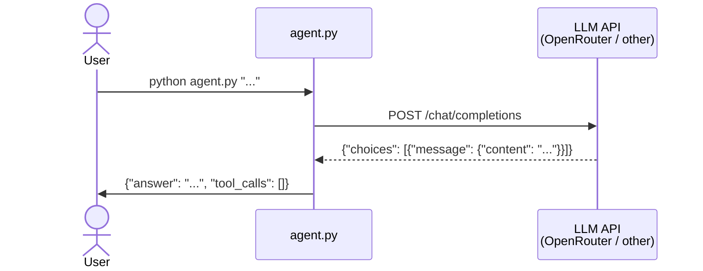

# Call an LLM from Code

Build a CLI that connects to an LLM and answers questions about the course.

## [Git workflow](../../../wiki/git-workflow.md)

1. Create an issue titled `[Task] Call an LLM from Code`.
2. Pull latest `main` from `origin` and `upstream`.
3. Create a branch from `main` (e.g., `task/call-an-llm-from-code`).
4. Work on the branch. Commit as you go using [conventional commits](https://www.conventionalcommits.org/) (e.g., `feat:`, `docs:`, `test:`).
5. Push, create a PR to `main` in **your fork** (not upstream). Link the issue using a keyword (e.g., `Closes #1`).
6. Get a review from your partner, merge (this closes the issue automatically), delete the branch.

## What you will build

A `Python` CLI program (`agent.py`) that takes a question, sends it to an LLM, and returns a structured JSON answer.

```
User question → System prompt + question → LLM API → Answer
```



## CLI interface

**Input** — a question as the first command-line argument:

```bash
python agent.py "What does REST stand for?"
```

**Output** — a single JSON line to stdout:

```json
{"answer": "Representational State Transfer.", "tool_calls": []}
```

**Rules:**

- `answer` and `tool_calls` fields are required in the output.
- `tool_calls` is an empty array for this task (you will populate it in Task 2).
- Only valid JSON goes to stdout. All debug/progress output goes to **stderr**.
- The agent must respond within 60 seconds.
- Exit code 0 on success.

## LLM access

Your agent needs an LLM that supports the OpenAI-compatible chat completions API. You are free to use any provider.

[OpenRouter](https://openrouter.ai) offers free models with no credit card required. Look for models that support **tool calling** — you will need this in Task 2.

> **Tip:** Free-tier models can hit rate limits (`429`) and occasional `5xx` errors. Keep this in mind when designing your agent and see [Optional Task 1](../optional/task-1.md#advanced-agent-features) for retry logic with backoff.

Store your LLM key in `.env.agent.secret` (gitignored by the `*.secret` pattern). An example file is provided:

```bash
cp .env.agent.example .env.agent.secret
```

Edit `.env.agent.secret` and fill in `LLM_API_KEY`, `LLM_API_BASE`, and `LLM_MODEL`. Your agent reads from this file.

> **Note:** This is **not** the same as `LMS_API_KEY` in `.env.docker.secret`. That one protects your backend LMS endpoints. `LLM_API_KEY` authenticates with your LLM provider.

## Deliverables

### 1. Plan (`plans/task-1.md`)

Before writing code, create `plans/task-1.md`. Describe your plan:

- Which LLM provider and model you will use, and why.
- How you will structure the agent (argument parsing, API call, output formatting).
- What your system prompt strategy will be.

Commit:

```text
docs: add implementation plan for LLM integration
```

### 2. Agent (`agent.py`)

Create `agent.py` in the project root. The agent must handle questions about these course topics using its system prompt:

- **Git**: branches, commits, merging, PRs, issues, workflows.
- **REST**: HTTP methods, status codes, authentication vs authorization.
- **Docker**: containers, images, Dockerfile, Docker Compose, volumes.
- **SQL**: SELECT, JOIN, GROUP BY, aggregation functions.
- **Testing**: unit tests, e2e tests, pytest.
- **ETL**: extract-transform-load, pagination, idempotent upserts.
- **Agents**: agentic loops, tool calling, LLM APIs.

Commit:

```text
feat: implement LLM-powered agent CLI
```

### 3. Documentation (`AGENT.md`)

Create `AGENT.md` in the project root documenting:

- **Architecture**: how the agent works (input parsing, LLM call, output formatting).
- **LLM provider**: which provider and model you chose, and why.
- **System prompt strategy**: how you covered the course topics.
- **How to run**: the command and required environment variables.

Commit:

```text
docs: add agent architecture documentation
```

### 4. Tests (5 tests)

Create 5 regression tests that verify the agent works. Each test should:

- Run `agent.py` as a subprocess with a known question.
- Parse the stdout JSON.
- Check that `answer` and `tool_calls` are present.
- Check that the answer contains expected keywords.

Commit:

```text
test: add regression tests for agent
```

### 5. Deployment

The agent must work on your VM. The autochecker will SSH in and run:

```bash
python agent.py "..."
```

Make sure the API key environment variable is set on the VM (e.g., in `~/.bashrc`).

## Acceptance criteria

- [ ] Issue has the correct title.
- [ ] `plans/task-1.md` exists with the implementation plan (committed before code).
- [ ] `agent.py` exists in the project root.
- [ ] `python agent.py "..."` outputs valid JSON with `answer` and `tool_calls`.
- [ ] The agent answers course topic questions correctly.
- [ ] The API key is stored in `.env.agent.secret` (not hardcoded).
- [ ] `AGENT.md` documents the solution architecture.
- [ ] 5 regression tests exist and pass.
- [ ] The agent works on the VM via SSH.
- [ ] PR is approved and merged.
- [ ] Issue is closed by the PR.
