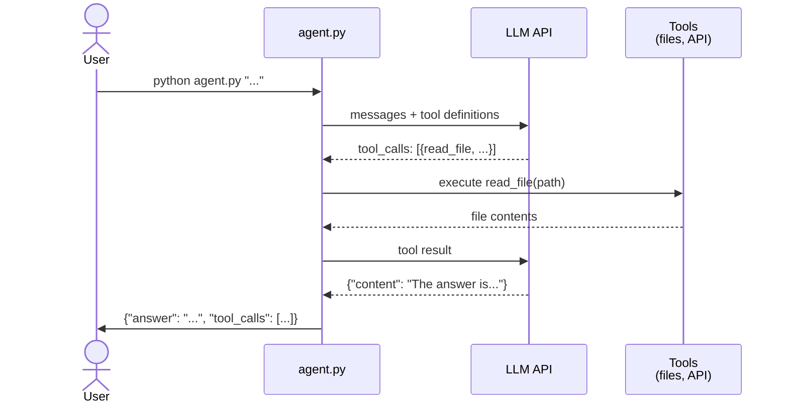

# Add Tools

In Task 1 you built a CLI that calls an LLM — but it can only answer from the knowledge baked into its training data or your system prompt. It cannot look at your actual code or query your running API. That is the difference between a chatbot and an **agent**: an agent has **tools** — functions it can call to interact with the real world, then reason about the results.

In this task you will give your agent three tools (`read_file`, `list_files`, `query_api`) and build the **agentic loop**: the LLM decides which tool to call, your code executes it, feeds the result back, and the LLM decides what to do next — call another tool or give the final answer.

## [Git workflow](../../../wiki/git-workflow.md)

1. Create an issue titled `[Task] Add Tools`.
2. Pull latest `main` from `origin` and `upstream`.
3. Create a branch from `main` (e.g., `task/add-tools`).
4. Work on the branch. Commit as you go using [conventional commits](https://www.conventionalcommits.org/) (e.g., `feat:`, `docs:`, `test:`).
5. Push, create a PR to `main` in **your fork** (not upstream). Link the issue using a keyword (e.g., `Closes #2`).
6. Get a review from your partner, merge (this closes the issue automatically), delete the branch.

## What you will build

An agentic loop: the LLM can request tool calls, your agent executes them and feeds the results back, repeating until the LLM gives a final answer.



## CLI interface

Same as Task 1. The only change: `tool_calls` is now populated.

**Input:**

```bash
python agent.py "What framework does the backend use?"
```

**Output:**

```json
{
  "answer": "The backend uses FastAPI.",
  "tool_calls": [
    {"tool": "read_file", "args": {"path": "backend/app/main.py"}, "result": "from fastapi import FastAPI..."}
  ]
}
```

**Rules (same as Task 1):**

- `answer` and `tool_calls` fields are required.
- Each entry in `tool_calls` must have `tool`, `args`, and `result`.
- Only valid JSON goes to stdout. All debug/progress output goes to **stderr**.
- The agent must respond within 60 seconds.
- Maximum 10 tool calls per question.
- Exit code 0 on success.

## Required tools

You must implement three tools and register them as function-calling schemas in your LLM request.

### `read_file`

Read a file from the project repository.

- **Parameters:** `path` (string) — relative path from project root.
- **Returns:** file contents as a string, or an error message if the file doesn't exist.
- **Security:** must not read files outside the project directory.

### `list_files`

List files and directories at a given path.

- **Parameters:** `path` (string) — relative directory path from project root.
- **Returns:** newline-separated listing of entries.
- **Security:** must not list directories outside the project directory.

### `query_api`

Call your deployed backend API.

- **Parameters:** `method` (string — GET, POST, etc.), `path` (string — e.g., `/items`), `body` (string, optional — JSON request body).
- **Returns:** JSON string with `status_code` and `body`.
- **Authentication:** use `LMS_API_KEY` from `.env.docker.secret` (the backend key, not the LLM key).

## The agentic loop

Your agent should follow this pattern:

1. Send the user's question + tool definitions to the LLM.
2. If the LLM responds with `tool_calls` → execute each tool, append results as `tool` role messages, go to step 1.
3. If the LLM responds with a text message (no tool calls) → that's the final answer. Output JSON and exit.
4. If you hit 10 tool calls → stop looping, use whatever answer you have.

## Deliverables

### 1. Plan (`plans/task-2.md`)

Before writing code, create `plans/task-2.md`. Describe:

- How you will define tool schemas (JSON format for the LLM).
- How you will implement the agentic loop (detect tool calls, execute, feed back).
- How you will handle security (path restriction, API authentication).

Commit:

```text
docs: add implementation plan for tool calling
```

### 2. Tools and agentic loop (update `agent.py`)

Update `agent.py` to:

- Define `read_file`, `list_files`, and `query_api` as function-calling schemas.
- Implement the agentic loop (tool call → execute → feed result → repeat).
- Record all tool calls in the `tool_calls` output array.

Commit:

```text
feat: add tool calling (read_file, list_files, query_api)
```

### 3. Documentation (update `AGENT.md`)

Update `AGENT.md` to document:

- **Tools:** what each tool does, its parameters, and security constraints.
- **Agentic loop:** how the loop works (when it calls tools, when it stops).
- **Configuration:** any new environment variables needed (e.g., API base URL for `query_api`).

Commit:

```text
docs: update agent documentation with tool calling
```

### 4. Tests (5 tests)

Add 5 regression tests that verify tool calling works. Each test should:

- Run `agent.py` as a subprocess with a question that requires a tool.
- Parse the stdout JSON.
- Check that `tool_calls` is non-empty and contains the expected tool name.
- Check that the answer is reasonable.

Example test questions:

- `"What framework does the backend use?"` → expects `read_file` in tool_calls.
- `"What files are in the backend/app/routers/ directory?"` → expects `list_files` in tool_calls.
- `"How many items are in the database?"` → expects `query_api` in tool_calls.

Commit:

```text
test: add regression tests for tool calling
```

### 5. Deployment

Deploy the updated agent to your VM. The autochecker will SSH in and run questions that require tools.

Make sure:

- The project repo is accessible to `agent.py` on the VM.
- `LMS_API_KEY` is available for `query_api` to authenticate with the backend.
- The backend is running and reachable from `agent.py`.

## Acceptance criteria

- [ ] Issue has the correct title.
- [ ] `plans/task-2.md` exists with the implementation plan (committed before code).
- [ ] `agent.py` defines `read_file`, `list_files`, and `query_api` as tool schemas.
- [ ] The agentic loop executes tool calls and feeds results back to the LLM.
- [ ] `tool_calls` in the output is populated when tools are used.
- [ ] Tools do not access files outside the project directory.
- [ ] `query_api` authenticates with `LMS_API_KEY`.
- [ ] `AGENT.md` documents the tools and agentic loop.
- [ ] 5 tool-calling regression tests exist and pass.
- [ ] The agent works on the VM via SSH.
- [ ] PR is approved and merged.
- [ ] Issue is closed by the PR.
