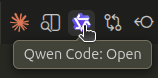

# Qwen Code

<h2>Table of contents</h2>

- [What is `Qwen Code`](#what-is-qwen-code)
- [Set up `Qwen Code`](#set-up-qwen-code)
  - [Set up the `Qwen Code` CLI](#set-up-the-qwen-code-cli)
  - [Set up the `Qwen Code Companion` extension for `VS Code`](#set-up-the-qwen-code-companion-extension-for-vs-code)
  - [Set up the `GitHub Copilot Chat` extension for `VS Code`](#set-up-the-github-copilot-chat-extension-for-vs-code)
- [Check the `Qwen Code` credentials file](#check-the-qwen-code-credentials-file)
- [Open a chat with `Qwen Code`](#open-a-chat-with-qwen-code)
  - [Open a chat with `Qwen Code` using the CLI](#open-a-chat-with-qwen-code-using-the-cli)
  - [Open a chat with `Qwen Code` using the `Qwen Code Companion` extension for `VS Code`](#open-a-chat-with-qwen-code-using-the-qwen-code-companion-extension-for-vs-code)
  - [Open a chat with `Qwen Code` using the `GitHub Copilot Chat` extension for `VS Code`](#open-a-chat-with-qwen-code-using-the-github-copilot-chat-extension-for-vs-code)
- [Chat with `Qwen Code`](#chat-with-qwen-code)
  - [Refer to a file](#refer-to-a-file)
  - [Use a skill](#use-a-skill)

## What is `Qwen Code`

[`Qwen Code`](https://github.com/QwenLM/qwen-code) is a [coding agent](./coding-agents.md#what-is-a-coding-agent) that:

- [provides 1000 free requests per day](https://github.com/QwenLM/qwen-code#why-qwen-code) to the [`Qwen3-Coder`](https://github.com/QwenLM/Qwen3-Coder) model (see [Model](./llm.md#model)).
- is available in Russia.

See [Set up `Qwen Code`](#set-up-qwen-code).

## Set up `Qwen Code`

<!-- no toc -->
- Method 1: [Set up the `Qwen Code` CLI](#set-up-the-qwen-code-cli).
- Method 2: [Set up the `Qwen Code Companion` extension for `VS Code`](#set-up-the-qwen-code-companion-extension-for-vs-code).
- Method 3: [Set up the `GitHub Copilot Chat` extension for `VS Code`](#set-up-the-github-copilot-chat-extension-for-vs-code).

### Set up the `Qwen Code` CLI

> [!NOTE]
> See [CLI](./cli.md#what-is-a-cli)

1. [Install `Node.js`](./nodejs.md#install-nodejs).

2. Copy the single-line [shell command](./shell.md#shell-command) from the [installation instructions](https://github.com/QwenLM/qwen-code#installation) for [`Qwen Code`](#what-is-qwen-code).

3. [Open a chat with `Qwen Code` using the CLI](#open-a-chat-with-qwen-code-using-the-cli).

4. Write `/auth` in the chat to [authenticate via Qwen OAuth](https://github.com/QwenLM/qwen-code?tab=readme-ov-file#authentication).

5. [Check the `Qwen Code` credentials file](#check-the-qwen-code-credentials-file).

### Set up the `Qwen Code Companion` extension for `VS Code`

1. [Install the `VS Code` extension](./vs-code.md#install-the-vs-code-extension):
   `qwenlm.qwen-code-vscode-ide-companion`.

2. [Open a chat with `Qwen Code` using the `Qwen Code Companion` extension for `VS Code`](#open-a-chat-with-qwen-code-using-the-qwen-code-companion-extension-for-vs-code).

3. Write `/login` in the chat to [authenticate via Qwen OAuth](https://github.com/QwenLM/qwen-code?tab=readme-ov-file#authentication).

4. Complete the authentication procedure.

5. [Check the `Qwen Code` credentials file](#check-the-qwen-code-credentials-file).

### Set up the `GitHub Copilot Chat` extension for `VS Code`

> [!NOTE]
> `Copilot Chat` is not officially available for users in Russia (see [this discussion](https://github.com/orgs/community/discussions/182386)).

1. [Install](https://code.visualstudio.com/docs/configure/extensions/extension-marketplace#_browse-for-extensions) the `github.copilot-chat` and `denizhandaklr.vscode-qwen-copilot` extensions.

2. [Run using the `Command Palette`](./vs-code.md#run-a-command-using-the-command-palette):
   `Qwen Copilot: Authenticate` to [authenticate via Qwen OAuth](https://github.com/QwenLM/qwen-code?tab=readme-ov-file#authentication).

3. [Check the `Qwen Code` credentials file](#check-the-qwen-code-credentials-file).

4. [Run using the `Command Palette`](./vs-code.md#run-a-command-using-the-command-palette):
   `Chat: Manage Language Models`.

5. Click `Add Models`.

6. Click `Qwen Code`.

7. Double click `Qwen 3 Coder Plus` to make the model visible.

8. [Open a chat with `Qwen Code` using the `GitHub Copilot Chat` extension for `VS Code`](#open-a-chat-with-qwen-code-using-the-github-copilot-chat-extension-for-vs-code).

## Check the `Qwen Code` credentials file

[Open in `VS Code` the file](./vs-code.md#open-the-file):
`~/.qwen/oauth_creds.json`.

This file contains the `Qwen Code` authentication credentials.

The file must be non-empty.

## Open a chat with `Qwen Code`

<!-- no toc -->
- Method 1: [Open a chat with `Qwen Code` using the CLI](#open-a-chat-with-qwen-code-using-the-cli)
- Method 2: [Open a chat with `Qwen Code` using the `Qwen Code Companion` extension for `VS Code`](#open-a-chat-with-qwen-code-using-the-qwen-code-companion-extension-for-vs-code)
- Method 3: [Open a chat with `Qwen Code` using the `GitHub Copilot Chat` extension for `VS Code`](#open-a-chat-with-qwen-code-using-the-github-copilot-chat-extension-for-vs-code)

### Open a chat with `Qwen Code` using the CLI

> [!NOTE]
> See [CLI](./cli.md#what-is-a-cli).

1. [Run in the `VS Code Terminal`](./vs-code.md#run-a-command-in-the-vs-code-terminal):

   ```terminal
   qwen
   ```

2. If you want to exit the chat:

   1. Write `/quit` in the chat.
   2. Press `Enter`.

### Open a chat with `Qwen Code` using the `Qwen Code Companion` extension for `VS Code`

Method 1:

1. Go to the [`Editor Toolbar`](./vs-code.md#editor-toolbar).
2. Click the `Qwen Code: Open` icon.

   </img>

Method 2:

1. [Run using the `Command Palette`](./vs-code.md#run-a-command-using-the-command-palette):
   `Qwen Code: Open`.

### Open a chat with `Qwen Code` using the `GitHub Copilot Chat` extension for `VS Code`

1. [Run using the `Command Palette`](./vs-code.md#run-a-command-using-the-command-palette):
   `Chat: Open Chat`
2. The `CHAT` panel will open.
3. Go to `CHAT`.
4. Click `Auto` (`Pick Model`).
5. Click `Qwen 3 Coder Plus`.

## Chat with `Qwen Code`

Actions:

<!-- no toc -->
- [Refer to a file](#refer-to-a-file)
- [Use a skill](#use-a-skill)

### Refer to a file

Write `@<file-path>` (without `<` and `>`) to refer to the file at the [`<file-path>`](./file-system.md#file-path).

Example: `@main.py`.

### Use a skill

1. [Open a chat with `Qwen Code`](#open-a-chat-with-qwen-code).
2. Write `skills`.
3. Press `Enter`.
4. To use the skill, write the [skill name](./coding-agents.md#skill-name) and the [skill arguments](./coding-agents.md#skill-arguments).

   Example: `commit @main.py`.

   See [Refer to a file](#refer-to-a-file).
5. Press `Enter`.

<!-- TODO qwen on VM -->
<!-- 

#### Install nodejs on the VM

- scp ~/.qwen/oauth_creds.json se-toolkit-vm:~/.qwen/oauth_creds.json
- nix profile add nixpkgs#nodejs_25
 -->