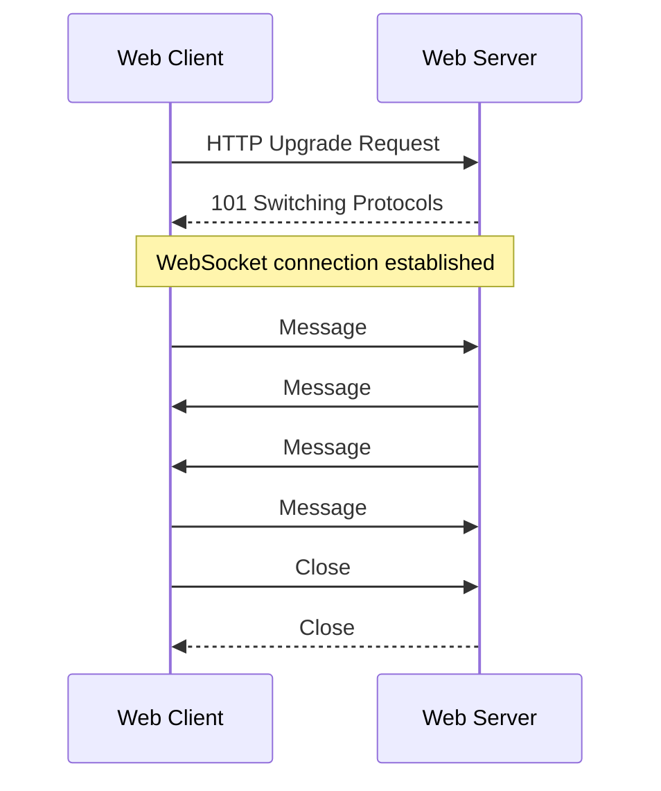

# `WebSocket`

<h2>Table of contents</h2>

- [What is `WebSocket`](#what-is-websocket)
- [Communication using `WebSocket`](#communication-using-websocket)
- [`WebSocket` vs `HTTP`](#websocket-vs-http)
- [`WebSocket` URL](#websocket-url)

## What is `WebSocket`

`WebSocket` is a [communication protocol](./computer-networks.md#protocol) that provides full-duplex (two-way) communication between a [web client](./web-infrastructure.md#web-client) and a [web server](./web-infrastructure.md#web-server) over a single, long-lived connection.
Unlike [`HTTP`](./http.md#what-is-http), where the [client](./web-infrastructure.md#web-client) must initiate every exchange, `WebSocket` allows both sides to send messages at any time after the connection is established.

Docs:

- [The WebSocket API (MDN)](https://developer.mozilla.org/en-US/docs/Web/API/WebSockets_API)

## Communication using `WebSocket`

A `WebSocket` connection begins with an [`HTTP`](./http.md#what-is-http) upgrade request.
Once the [server](./web-infrastructure.md#web-server) accepts the upgrade, both sides switch to the `WebSocket` [protocol](./computer-networks.md#protocol) and can send messages independently.

The connection stays open until either side closes it.

## `WebSocket` vs `HTTP`

|              | [`HTTP`](./http.md#what-is-http)                          | `WebSocket`                          |
| ------------ | --------------------------------------------------------- | ------------------------------------ |
| Direction    | Client → Server only                                      | Both directions                      |
| Connection   | One request, one response, then closed                    | Long-lived, stays open               |
| Initiated by | Client                                                    | Client opens; then either side sends |
| Use case     | [REST APIs](./rest-api.md#what-is-a-rest-api), page loads | Chat, live updates, streaming        |

## `WebSocket` URL

A `WebSocket` [URL](./computer-networks.md#url) uses the `ws://` scheme (or `wss://` for encrypted connections, analogous to [`HTTPS`](./http.md#https)).

Example: `ws://localhost:8765`, `wss://example.com/chat`.

The URL may include [query parameters](./computer-networks.md#query-parameter) — for example, to pass an authentication token when opening the connection.
